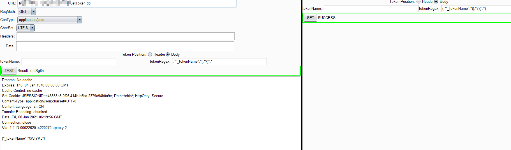
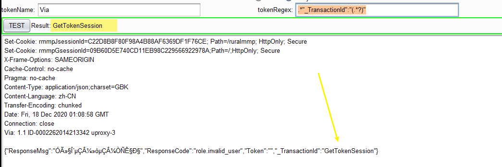
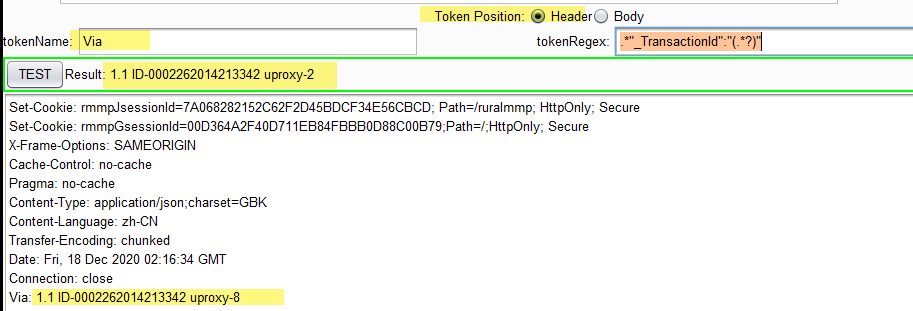
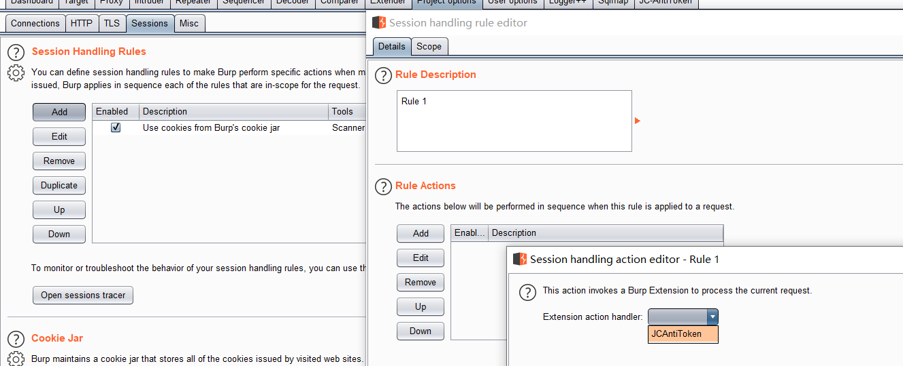
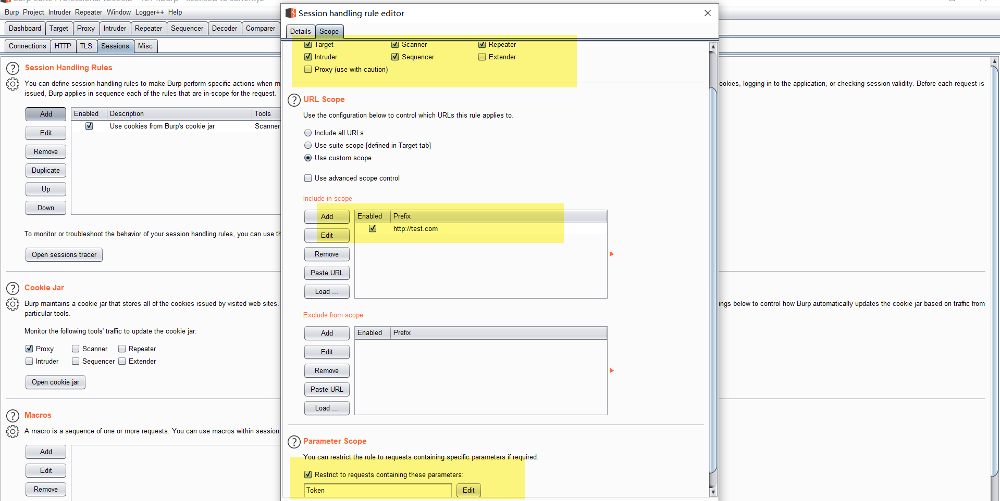

# JC-AntiToken

burp插件：python版，token防重放绕过

```shell
Author: JC0o0l,Jerrybird
Team: Z1-Sec
WeChat: JC_SecNotes(Zer0ne安全研究)
```

## 0x01 目标：

**token防重放绕过**

**界面效果如下：**




## 0x02 适用场景：

1. 请求包带有防重放的token
2. 该token需要去请求另一个接口才能得到

## 0x03 使用：

### 0x0301 下载安装：
1. 从GitHub下载该项目：https://github.com/chroblert/JC-AntiToken
2. Burp中配置python环境jython-2.7.jar
3. 加载JC-AntiToken.py插件

### 0x0302 配置：

#### (一)、左侧设置token在响应中位置：
1. URL：填写token接口的URL，如：https://test.com/getToken.php
    - 注：不要填写`?`及之后的参数
2. ReqMeth: 选择请求头方法
3. ConType: 选择Content-Type
4. CharSet: 选择编码方式
5. Headers: 设置请求头。(json字符串格式，字段和值使用双引用括起来)
    - 通过该Headers设置的请求头的优先级最高，会覆盖掉程序内置的请求头
    - Cookie除外，使用请求包中的cookie作为最新的cookie
6. Data: 设置请求体
    - 对于GET来说，Data被编码成urlencode形式。通过`?`追加到URL后面
    - 对于POST来说，可选择json格式和urlencode两种形式
7. TokenPosition: token在token接口响应包的哪个位置
    - Body: 在响应体中
        - 若选择Body，则在"TokenRegex"项中填写正则表达式
        - 注：该正则表达式从^开始匹配，用`()`括起来的为要提取的token值
        - 示例：`.*"_TransactionId":"(.*?)"`
        - 
    - Header: 在请求头中
        - 若选择Header，则在"TokenName"中填写请求头名称
        - 注：区分大小写
        - 示例: `Via`
        - 
8. TEST: 设置参数并测试是否有效
    - 若成功，则显示提取出的数据
    - 若失败，则显示None
9. 下方文本框：显示响应报文

#### (二)、右侧设置token在请求中位置：
1. TokenPosition：token在请求报文中的位置：
    - Header：在URL参数或请求头中
        - 设置TokenName
    - Body：在请求体中
        - 设置TokenRegex
        - 格式：`(.*前缀)(要替换的地方)(后缀.*)`  
        如：`(.*"_tokenName":")(.*?)(".*)` 匹配
        `,"_tokenName":"ir9xGm"}`
        

2. SET：检查并设置参数

#### (三)、配置Session Handling Rules


1. 新建一个规则，
2. 新建一个Rule Action
3. 选择Invoke a Burp Extension
4. 选择JC-AntiToken
5. 之后根据项目需求设置Scope：
    - 设置生效的工具
    - 设置生效的URL
    - 设置生效的条件：请求中具有某参数才生效



## 0x04 总结
比较简单的一款小burp插件，大部分时间耗在布局和排版上面了

注：防重放，使用多线程会报错，非本插件功能问题，是目标网站的限制

## 0x05 踩坑指南
1. 问题：'unicode' object has no attribute 'items'

	解决：
		○ 在文件首行添加：
		# -*- coding: utf-8 -*-
		○ 在文件代码前添加：
		sys_encoding = sys.getfilesystemencoding()
2. 问题：BoxLayout控制JTextField的高度

	解决：
		textField = new JTextField( ... );
		textField.setMaximumSize( textField.getPreferredSize() );
		
---
	
参考资料：[让BoxLayout管理器尊重JTextField的实际尺寸](https://blog.csdn.net/andycpp/article/details/1189221?utm_medium=distribute.pc_relevant.none-task-blog-OPENSEARCH-7.control&depth_1-utm_source=distribute.pc_relevant.none-task-blog-OPENSEARCH-7.control)

参考资料：[How do I keep JTextFields in a Java Swing BoxLayout from expanding?](https://stackoverflow.com/questions/2709220/how-do-i-keep-jtextfields-in-a-java-swing-boxlayout-from-expanding)

参考资料：[HOW TO RAPIDLY BUILD A BURP SESSION HANDLING EXTENSION USING JAVASCRIPT](https://sec-consult.com/en/blog/2013/06/how-to-rapidly-build-a-burp-session-handling-extension-using-javascript/)

参考资料：[BurpSuite插件编写](http://sh1yan.top/2020/03/02/Writing-the-burpseuite-plug-in-beginner/)

参考资料：[urllib2添加headers和设置代理](https://blog.csdn.net/qq_37049781/article/details/81868372)

参考资料：[re-正则表达式操作](https://docs.python.org/zh-cn/3/library/re.html)

参考资料：[python中str,bytes,bytearray的相互转化](https://blog.csdn.net/doudoudouzoule/article/details/85335268)